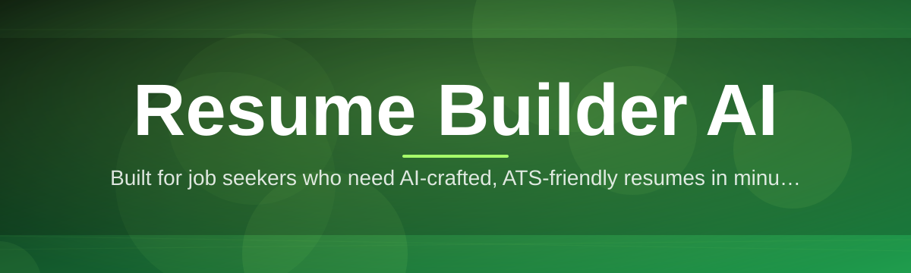
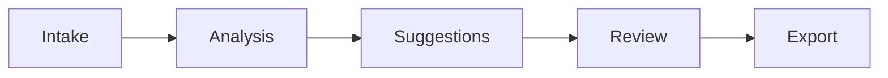

# resume-builder-ai-assistant 📄✨

  

*Your resume, rebuilt by an AI that actually reads the room — not just the template.*

  

## 🍳 What This Is NOT

It's not another cookie-cutter template picker that swaps fonts and calls it "AI." It's not a bloated SaaS dashboard that nags you for a subscription before you've typed a single bullet point. And it's definitely not a black box that spits out generic corporate word-soup and hopes you don't notice.

**What it actually is:** a standalone Windows desktop assistant that sits between your career history and the job you actually want. Resume Builder AI Assistant reads your raw experience, understands the target role, and helps you shape a resume that a human recruiter *and* an ATS parser will both nod at. This is a passion project — built because job hunting is stressful enough without fighting your own resume software.

---

## 🧠 Overview

I started this project after watching too many talented people get filtered out by keyword-matching bots before a human ever saw their name. **resume-builder-ai-assistant** is a local-first, AI-assisted resume builder for Windows that focuses on three things: clarity of writing, alignment with the job description, and formatting that survives real-world Applicant Tracking Systems. No cloud dashboards, no mandatory accounts — just a fast, focused app that opens, helps, and gets out of your way.

Under the hood, the tool blends a language-aware rewriting engine with a set of resume-specific heuristics learned from thousands of real job postings and resume structures. It's designed for career-changers polishing a first draft, new grads staring at a blank page, and seasoned professionals who just haven't updated their resume since 2019. Whether you're targeting a resume builder for a tech role, a creative portfolio blurb, or a straightforward operations position, the assistant adapts its tone and structure suggestions to the job, not the other way around.

This is a solo-maintained, genuinely-loved side project. It's not backed by a VC round or a growth team — it's backed by late nights, strong coffee, and the belief that AI resume tools should feel like a smart friend reviewing your draft, not a vending machine for buzzwords.

---

## 🔥 Capabilities That Actually Pull Their Weight

  

- **Job-description mirroring** — paste the posting, and the assistant highlights which of your bullet points already speak the employer's language, and which ones need a translation pass.

- **Bullet point surgery** — turns "responsible for managing team" into results-driven, metric-anchored statements without inventing achievements you didn't have.

- **ATS compatibility scan** — flags tables, text boxes, weird fonts, and layout tricks that look great to humans but turn into garbled soup inside a resume builder AI parser on the hiring side.

- **Multi-version resume tracks** — keep a "technical," a "leadership," and a "general" version of the same career history without duplicating files manually.

- **Tone dial** — slide between formal, confident, and concise phrasing per section; the summary doesn't have to sound like the skills list.

- **Gap-aware phrasing** — for career breaks or pivots, suggests neutral, honest framing instead of either hiding gaps or over-explaining them.

- **Local draft history** — every meaningful edit is snapshotted so you can rewind a rewrite that went too far.

- **Export fidelity check** — previews exactly how your PDF/DOCX will render before you send it, because "it looked fine on my screen" has ruined more interviews than it should.

> [!TIP]
> Run the **Job-description mirroring** pass *before* you rewrite anything manually — it saves you from polishing bullet points that were never going to matter for that specific role.

---

## 🚀 Getting Started

1. Visit the landing page using the download button above or below.

2. Grab the latest Windows build — it's a standalone package, no installer wizard hostage-situation.

3. Launch `ResumeBuilderAI.exe` and let it run its first-time setup (creates a local workspace folder for your drafts).

4. Import an existing resume or start from a blank canvas, paste a job description if you have one, and let the assistant do its first pass.

> [!NOTE]
> First launch takes a few extra seconds while the local language model warms up. Subsequent launches are near-instant.

---

## 🖥️ System Requirements

| Requirement | Details |
|---|---|
| OS | Windows 10 (64-bit) or Windows 11 |
| RAM | 4 GB minimum, 8 GB recommended |
| Disk Space | ~600 MB free |
| Dependencies | None — fully standalone, no runtime installs required |
| Internet | Not required for core resume editing; optional for update checks |

> [!IMPORTANT]
> This is a Windows-only build for 2026. There is currently no macOS or Linux release, and none is promised — keep an eye on the landing page for future platform news rather than assuming a port exists.

---

## ⚙️ How It Works

The pipeline is intentionally simple — a resume builder AI assistant should feel transparent, not magical in a suspicious way.

1. **Intake** — you provide raw experience (import or manual entry) plus an optional job description.

2. **Analysis** — the engine parses structure, tone, and keyword density against the target role.

3. **Suggestion pass** — rewrites and restructuring options are generated per section, never applied silently.

4. **Your review** — you accept, tweak, or reject every suggestion; nothing overwrites your voice without consent.

5. **Export** — a clean, ATS-friendly PDF or DOCX rolls out, formatted and ready to send.

---

## 🩹 Troubleshooting

<strong>My exported PDF looks different from the in-app preview.</strong>

Make sure you're using the built-in export renderer rather than a third-party PDF printer driver — some drivers rescale fonts and break the alignment grid.

<strong>The tone suggestions feel too aggressive/confident for my field.</strong>

Open Settings → Tone Dial and lower the confidence slider. Academic and public-sector resumes usually sit better around the "measured" setting.

<strong>Why does it flag my two-column layout as an ATS risk?</strong>

Many resume builder AI parsers on the recruiter side read left-to-right, top-to-bottom in a single pass. Multi-column layouts can scramble reading order even if they look perfect visually.

<strong>Can I recover a previous draft after a big rewrite?</strong>

Yes — open the local draft history panel (default shortcut below) and roll back to any auto-saved snapshot.

<strong>The app won't launch after a Windows update.</strong>

Right-click the executable → Properties → Unblock, then relaunch. This is a standard Windows SmartScreen quirk for newer standalone apps.

---

## 🎛️ UI, UX & Shortcuts

**Themes:** Light, Dark, and "Paper" (a warm, print-simulating theme for proofreading).

**Keyboard shortcuts:**

| Shortcut | Action |
|---|---|
| `Ctrl + N` | New resume draft |
| `Ctrl + S` | Save current draft |
| `Ctrl + Shift + H` | Open draft history panel |
| `Ctrl + J` | Paste / update job description |
| `Ctrl + R` | Run rewrite suggestions on active section |
| `Ctrl + E` | Export current resume |
| `Ctrl + ,` | Open Settings |
| `F1` | Quick help overlay |

> [!TIP]
> Toggle the Tone Dial with `Ctrl + T` mid-edit — you don't need to open Settings just to nudge one section's phrasing.

Settings also let you pin a default export format, set a preferred page length (one-page vs. two-page bias), and choose whether the assistant auto-runs analysis on paste.

---

## 🤝 Contributing & Community

This started as a one-person passion project, but it's grown legs. Bug reports, UX feedback, and phrasing-suggestion ideas are all genuinely welcome via Issues. If you've got resume-writing domain expertise (recruiters, career coaches, HR folks — this means you), your input on the heuristics is especially valuable.

> [!WARNING]
> Please don't open issues requesting features that turn this into a mass-spam application tool. The goal is thoughtful, individual resume building — not bulk-blasting recruiters.

Discussion threads are open for sharing before/after resume wins (redact personal info, please) and swapping tips on getting the most out of the tone dial and ATS scan.

---

## 📜 License

Released under the [MIT License](LICENSE), 2026. Use it, learn from it, build on it.

---

## ⚠️ Disclaimer

Resume Builder AI Assistant is a writing and formatting aid — it does not guarantee interviews, job offers, or ATS pass-through on every platform, because every hiring pipeline is different. Always give your resume a final human read-through before sending. This project is provided as-is, with love, but without warranty of any kind.

---

## 🗒️ Changelog

**v2026.3 — "Quiet Confidence"**
- Added the Tone Dial with granular confidence slider
- Fixed a rare crash when importing DOCX files with nested tables
- Improved ATS compatibility scan accuracy for two-column layouts

**v2026.2 — "Mirror Match"**
- Introduced job-description mirroring pass
- Added Paper theme for proofreading
- Draft history panel now supports named snapshots

**v2026.1 — "First Draft"**
- Initial public standalone Windows release
- Core rewrite engine, PDF/DOCX export, and gap-aware phrasing shipped